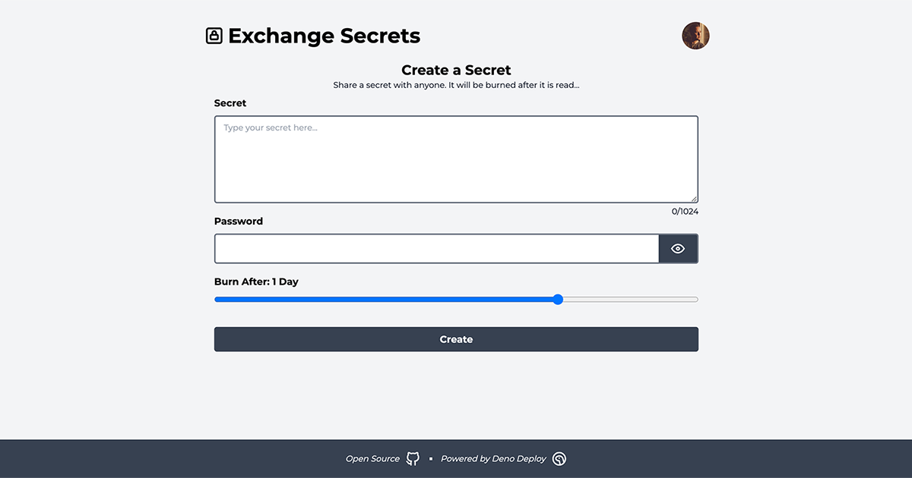

# Exchange Secrets

> A simple, secure, and private way to share secrets.



## Description

> This project was created for the [Deno Deploy Hackathon](https://deno.com/blog/deno-kv-hackathon) that ran between June 12 and June 15th 2023.

- Share secrets with anyone, using a simple textbox and a password.
- Secrets stored as encrypted data, so they are safe from prying eyes.
- You can login using your Github account, so you can see the list of (open) secrets you have created.
- Secrets are deleted once they have been decrypted, or when the maximum number of decryption attempts has been reached (see environment variables below). This is to prevent brute force attacks.
- Admin users have access to a list of all secrets, and can delete secrets if necessary.

## Usage

Start the project:

```
deno task start
```

This will watch the project directory and restart as necessary.

## Technical Details

- It stores data using [Deno KV](https://deno.com/kv)
- All data is encrypted using AES-CBC and stored in the KV store (Cipher text && IV). Decryption is done on the server-side, so we can monitor the number of decryption attempts and delete the secret if it is being brute forced.
  - > Note: I am aware that AES-CBC is not the most secure. I used this method because I could find good working examples. For a production version I would probably use AES-GCM.
- It uses the excellent [Deno KV Oauth](https://deno.land/x/deno_kv_oauth@v0.2.0-beta) library to authenticate. It this demo I am only implementing Github authentication, but for a future version I might add others.
- The project structure was inspired by the [hashrock/kv-sketchbook](https://github.com/hashrock/kv-sketchbook) repository. I used some concepts regarding authentication and sessionData, ended up rewriting most of it.
- The UI is mostly just [Fresh](https://fresh.deno.dev/) and Tailwind CSS. For the profile popover I decided to use the [Flowbite plugin](https://deno.land/x/fresh_flowbite@1.0.0-1.6.3/) to make my life a little easier.

## Environment Variables

- `GITHUB_CLIENT_ID` - The Github client ID for OAuth
- `GITHUB_CLIENT_SECRET` - The Github client secret for OAuth
- `ADMIN_USER_ID` - A user id (or comma separated list of user ids) that will be granted admin access to the site. This is used to delete secrets.
- `MAX_DECRYPT_ATTEMPTS` - _(Optional, default: 3)_ - The maximum number of attempts to decrypt a secret before it is deleted. This is used to prevent brute force attacks.
- `MAX_SECRET_LENGTH` - _(Optional, default: 1024)_ - The maximum length of a secret.

## License

[MIT](LICENSE)
